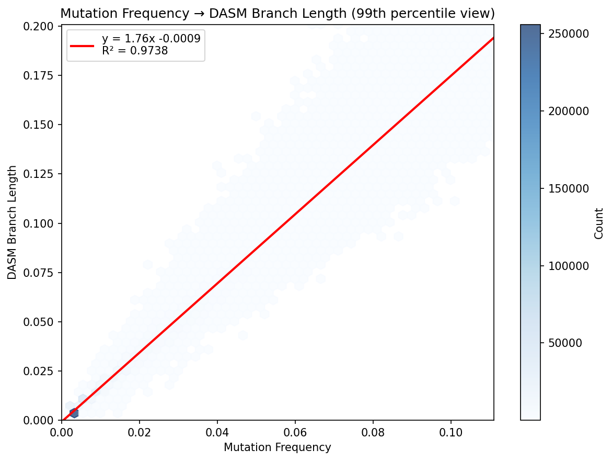

# DASM Branch Length vs Mutation Frequency

## Summary

We find a remarkably linear relationship between raw mutation frequency and DASM-inferred branch length, with $R^2 = 0.974$. The fitted relationship is:

$$t_{\text{DASM}} = 1.76 \cdot f_{\text{mut}} - 0.001$$

where $f_{\text{mut}}$ is the fraction of nucleotide sites that differ between parent and child sequences.

## Background: DASM Model

The DASM (Deep Amino acid Selection Model) predicts the probability of observing a child sequence given a parent sequence. For a codon at position $j$ mutating to codon $c$, the probability is:

$$\ell_{j,c}(t, X) = p_{j,c}(t, X) \times f_{j,a}(\bar{X})$$

where:

- $p_{j,c}(t, X)$ is the neutral probability of mutation to codon $c$ at site $j$ after time $t$ (from the Thrifty SHM model)
- $f_{j,a}(\bar{X})$ is the selection factor for amino acid $a$ at site $j$ (learned by DASM)
- $t$ is the branch length (jointly optimized during training)

### Neutral Mutation Model

The neutral mutation probability uses a Poisson model. For a nucleotide site $i$:

- Probability of mutation: $(1 - e^{-\lambda_i t}) \times s_{i,\beta}$
- Probability of no mutation: $e^{-\lambda_i t}$

where $\lambda_i$ is the site-specific mutation rate from the SHM model and $s_{i,\beta}$ is the substitution probability to nucleotide $\beta$.

For a codon (3 nucleotide sites), the probability of a specific codon change is the product of individual nucleotide probabilities.

## Why Linear?

### Small-$t$ Approximation

For small branch lengths, $1 - e^{-\lambda_i t} \approx \lambda_i t$. Summing over all $N$ nucleotide sites:

$$\mathbb{E}[\text{mutations}] \approx t \sum_{i=1}^{N} \lambda_i = t \cdot N \cdot \langle \lambda \rangle$$

Therefore:

$$f_{\text{mut}} = \frac{\mathbb{E}[\text{mutations}]}{N} \approx t \cdot \langle \lambda \rangle$$

This predicts a linear relationship $t \propto f_{\text{mut}}$ with slope $1/\langle \lambda \rangle$.

### Effect of Selection

Selection factors $f_{j,a} < 1$ on average (most mutations are deleterious). This reduces the probability of observing mutations:

$$P(\text{mutation}) \propto t \cdot \lambda \cdot f$$

To explain $N$ observed mutations when $\langle f \rangle < 1$, the model requires a longer branch length $t$ to compensate. The fitted slope of 1.76 implies:

$$\langle \lambda \rangle \cdot \langle f \rangle \approx \frac{1}{1.76} \approx 0.57$$

This makes biological sense: observed mutations are approximately 57% as likely as neutral expectation due to purifying selection.

### Complexity That Averages Out

Despite the model's complexity—site-specific rates $\lambda_i$, codon table degeneracy, position-dependent selection, and products of nucleotide probabilities—the aggregate behavior is remarkably linear. This occurs because:

1. **Averaging over many sites**: Each sequence has ~300+ nucleotides, so variations in $\lambda_i$ average out
2. **Consistent selection pressure**: The average selection factor $\langle f \rangle$ doesn't vary strongly with mutation count
3. **Self-consistent optimization**: DASM optimizes $t$ to maximize likelihood, which naturally scales with mutation count

## Results

### Data

- **Training set**: 742,377 parent-child pairs from v1jaffeCC + v1tangCC datasets
- **Validation set**: 138,256 pairs (held-out samples)

### Linear Regression

| Parameter | Value |
|-----------|-------|
| Slope | 1.7578 |
| Intercept | -0.0009 |
| $R^2$ | 0.9738 |
| RMSE | 0.0065 |

The near-zero intercept confirms the relationship passes through the origin as expected (zero mutations $\Rightarrow$ zero branch length).

### Residual Analysis

Residuals by mutation frequency decile show minimal systematic pattern:

| Decile | Mean Residual |
|--------|---------------|
| 0 (lowest) | +0.0007 |
| 1 | +0.0007 |
| 2 | +0.0007 |
| 3 | +0.0006 |
| 4 | +0.0002 |
| 5 | -0.0001 |
| 6 | -0.0005 |
| 7 | -0.0012 |
| 8 | -0.0016 |
| 9 (highest) | +0.0005 |

The slight negative residuals at intermediate-high mutation frequencies may reflect saturation effects (multiple hits at the same site) not fully captured by the linear approximation.

## Figure



The plot shows the relationship between raw mutation frequency (x-axis) and DASM-inferred branch length (y-axis) for 742,377 training pairs. Axes are trimmed to the 99th percentile for clarity. The red line shows the linear fit with $R^2 = 0.974$.

## Conclusion

The strong linear relationship between mutation frequency and DASM branch length provides a useful rule of thumb:

$$t_{\text{DASM}} \approx 1.76 \times f_{\text{mut}}$$

This relationship emerges from the model's structure despite considerable underlying complexity, and reflects the combined effect of site-specific mutation rates and purifying selection operating on antibody sequences.

---

## Appendix: Code

Full source: `docs/branch_length_regression.py`

### Computing Mutation Frequency

```python
def mutation_frequency(parent_seq, child_seq):
    """Compute fraction of nucleotide sites that differ."""
    mismatches = sum(1 for p, c in zip(parent_seq, child_seq) if p != c)
    return mismatches / len(parent_seq)
```

### Loading and Matching Data

The DASM branch length CSVs contain only values (no identifiers), stored in the same row order as the training data. We use `train_val_df_of_multiname` to replicate the exact loading sequence:

```python
from dnsmex.dxsm_data import train_val_df_of_multiname

# Load PCPs with train/val split matching training
pcp_df = train_val_df_of_multiname("v1jaffeCC+v1tangCC")

# Load DASM branch lengths
train_bls = pd.read_csv(f"{model_dir}/{model_name}.train_branch_lengths.csv")
val_bls = pd.read_csv(f"{model_dir}/{model_name}.val_branch_lengths.csv")

# Match by row order
train_df = pcp_df[pcp_df["in_train"]].reset_index(drop=True).copy()
train_df["dasm_branch_length"] = train_bls["branch_length"].values
```

### Linear Regression

```python
from scipy import stats

result = stats.linregress(df["mut_freq"], df["dasm_branch_length"])
# result.slope = 1.7578
# result.intercept = -0.0009
```

### Residual Analysis by Decile

```python
resid = df["dasm_branch_length"] - (result.slope * df["mut_freq"] + result.intercept)
df["decile"] = pd.qcut(df["mut_freq"], 10, labels=False)

for decile in range(10):
    mask = df["decile"] == decile
    print(f"Decile {decile}: mean residual = {resid[mask].mean():+.6f}")
```
